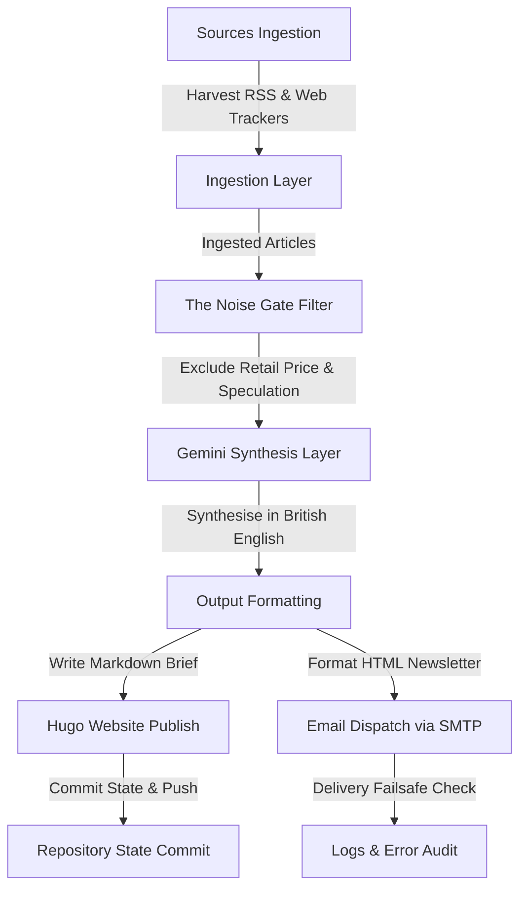

# Institutional Digital Asset Intelligence Engine (`DA-INTEL-01`)

An autonomous intelligence engine built to scan, harvest, filter, and synthesise weekly developments in the regulated digital asset ecosystem. 

Unlike retail crypto trackers, this system strictly filters out speculative retail news (price movements, meme coins, retail exchange listings). Instead, it isolates high-signal, post-trade, operational, and macroeconomic shifts across commercial banking, central banking, sovereign infrastructure, payment rails, and global regulatory frameworks.

The final output is a professional-grade executive briefing delivered directly to your email inbox and published to your static Hugo blog website every Monday morning.

---

## 1. System Architecture

The workflow below details how the engine operates autonomously in an ephemeral GitHub Actions runner:



---

## 2. Project File Map

* [intelligence_engine.py](file:///c:/Projects/dev/Digital%20Asset%20Intelligence/intelligence_engine.py): The core execution script.
* [config.json](file:///c:/Projects/dev/Digital%20Asset%20Intelligence/config.json): Source registry, noise-filtering parameters, and delivery configuration.
* [system_state.json](file:///c:/Projects/dev/Digital%20Asset%20Intelligence/system_state.json): Tracks processed article URLs to prevent duplicate publications.
* [.github/workflows/intelligence_engine.yml](file:///c:/Projects/dev/Digital%20Asset%20Intelligence/.github/workflows/intelligence_engine.yml): Scheduled workflow executing on GitHub Actions.
* [requirements.txt](file:///c:/Projects/dev/Digital%20Asset%20Intelligence/requirements.txt): Python dependencies configuration.

---

## 3. Configuration & Customisation

You can customise the ingestion sources and noise gate filters by editing [config.json](file:///c:/Projects/dev/Digital%20Asset%20Intelligence/config.json):

### Adding or Modifying Ingestion Feeds
Add entries under `"sources"` using the following format:
```json
"source_key": {
  "name": "Display Name of Source",
  "url": "https://example.com/rss.xml",
  "strategy": "Description of harvest strategy"
}
```

### Adapting filtering parameters
You can adjust the Gemini synthesis behaviour by modifying:
* `"allowed_attributes"` under `"filtering"`: High-signal concepts that the synthesiser must focus on.
* `"forbidden_attributes"` under `"filtering"`: Low-signal concepts that must be filtered out.

---

## 4. Scheduled Action Parameters

The engine is configured to execute automatically on GitHub Actions:
* **Schedule**: Weekly on **Mondays at 07:00 UTC** (08:00 AM UK time during British Summer Time / 07:00 AM UK time during Greenwich Mean Time).
* **Manual Run**: Supported via the `workflow_dispatch` trigger in the GitHub Actions tab.

---

## 5. Security & Environment Manifest

Sensitive API credentials and server passwords are not hardcoded. The engine queries these values dynamically from environment variables, which must be mapped to GitHub Repository Secrets:

| Secret Name | Purpose | Required/Optional |
| :--- | :--- | :--- |
| `GEMINI_API_KEY` | Google Gemini 2.5 API authorization key for processing and synthesis. | Required |
| `SMTP_USER` | Sender Gmail address utilised to dispatch the newsletter. | Required |
| `SMTP_PASS` | Gmail App Password (generated via Google Account settings). | Required |
| `HUGO_REPO_PAT` | Personal Access Token with `repo` scope to publish briefs to `suni639/sunilkandola-hugo`. | Required |
| `RECIPIENT_EMAIL` | Destination email address. Defaults to `SMTP_USER` if not configured. | Optional |

---

## 6. Local Operation & Development

To execute a run or test changes locally on your workstation:

### 1. Install Dependencies
```bash
pip install -r requirements.txt
```

### 2. Configure Local Credentials
* **Linux/macOS**: Export the environment variables in your terminal:
  ```bash
  export GEMINI_API_KEY="your_api_key"
  export SMTP_USER="your_email@gmail.com"
  export SMTP_PASS="your_app_password"
  ```
* **Windows**: The engine features a fallback lookup to the Windows User Registry. You can save your variables in the Windows Environment settings, or export them in PowerShell:
  ```powershell
  $env:GEMINI_API_KEY="your_api_key"
  $env:SMTP_USER="your_email@gmail.com"
  $env:SMTP_PASS="your_app_password"
  ```

### 3. Run the Engine
```bash
python intelligence_engine.py
```

---

## 7. Deduplication & State Management

To prevent the engine from processing the same developments twice:
* The system checks the local `system_state.json` file.
* Each parsed article URL is matched against `"processed_urls"`. If it exists in the list, the article is skipped.
* In GitHub Actions, the updated `system_state.json` is committed and pushed back to the main repository automatically at the end of every successful execution.
* If `system_state.json` is missing or deleted, the script resets gracefully and processes all articles current in the feeds (idempotent design).

---

## 8. Troubleshooting & Auditing

* **SMTP / E-mail Failures**: If email delivery fails, the engine retries delivery 3 times. On a local machine, it sleeps 15 minutes between retries. In GitHub Actions, it sleeps 10 seconds to avoid wasting action minutes.
* **Error Logs**: All warning logs and runtime errors (e.g. scraping blocks) are committed locally to `error_log.txt` (which is excluded from Git tracking to avoid polluting the workspace).
* **403 Forbidden Notices**: Feeds protected by firewalls (like Cloudflare) may block full-text scraping. In these cases, the engine logs a silent warning in `error_log.txt` and automatically falls back to using the RSS feed's summary text, allowing execution to complete successfully.
